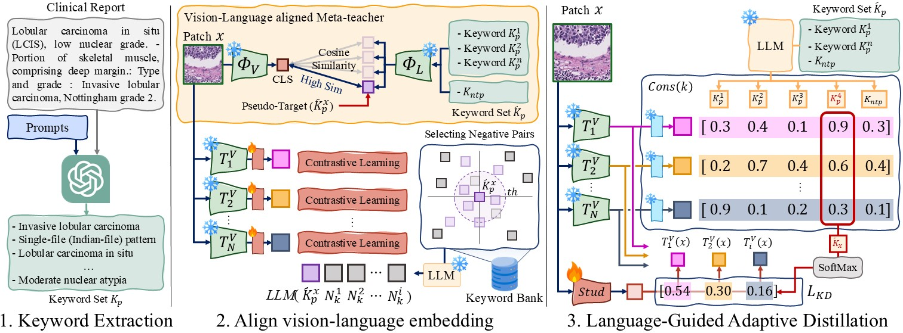

# LaGuadia: Language-Guided Adaptive Distillation from Pathology Foundation Models [MICCAI 2026]

<p>
    <a>
        
    </a>
    <a href="https://arxiv.org/pdf/2607.11257" target="_blank">
        
    </a>
</p>

[Gangsu Kim](https://scholar.google.com/citations?user=CmGABBYAAAAJ&hl=ko&oi=ao), and [Won-Ki Jeong](https://hvcl.korea.ac.kr/?page_id=359)†, [HVCL@KU](https://hvcl.korea.ac.kr/)  
† Corresponding Author

## Overview

LaGuadia (Language-Guided Adaptive DistillAtion), a framework that develops a compact pathology image encoder by dynamically integrating expertise from multiple PFMs under clinical linguistic guidance

## ⚙️ Installation
### 0. Inatall CLAM
We use [CLAM](https://github.com/mahmoodlab/CLAM), integrated within [TRIDENT](https://github.com/mahmoodlab/TRIDENT), for tissue segmentation and patching.
```
git clone https://github.com/mahmoodlab/trident.git && cd trident
pip install -e .
```
### 1. Install dependencies
```
git clone https://github.com/hvcl/LaGuadia.git && cd LaGuadia
pip install -r requirements.txt
```

## 🔥 Training
> [!NOTE]  
> For efficient training, pre-extracting teacher features before training is highly recommended.

### Stage 1. Keyword Extraction
Before training, keyword extraction from pathology reports must be performed.  
Keyword extraction can be done via [preparing/generate_keywords.py](./preparing/generate_keywords.py).
> [!TIP]  
> For the TCGA-{BRCA, STAD, THCA} cohorts, you can skip this step by using the provided CSV files in [data](./data/)
```
python ./preparing/generate_keywords.py
```

### Stage 2. Align Vision-Language embeddings via Meta-Teacher
**2a. Prepare data**  
The `root_dir` containing extracted features should follow the structure below:

```
root_dir/
├── uni/
├── gigapath/
├── virchow2/
└── medgemma/
```
**2b. Train Stage-2**  
```
python train_stage2.py --config-name train-stage-2-configs
```

### Stage 3. Language-Guided Adaptive Knowledge Distillation
```
python train_stage3.py --config-name train-stage-3-configs
```

## Citation
Will be available soon

## Acknowledgements
This implementation builds on ideas and components from several excellent open-source projects. We thank the authors of:
- [GigaPath](https://github.com/prov-gigapath/prov-gigapath)
- [UNI](https://github.com/mahmoodlab/UNI)
- [Virchow2](https://huggingface.co/paige-ai/Virchow2)
- [MedSigLIP](https://huggingface.co/google/medsiglip-448)
- [TRIDENT](https://github.com/mahmoodlab/trident/)([CLAM](https://github.com/mahmoodlab/clam))

Please cite the corresponding papers when using their models, code, or training recipes.